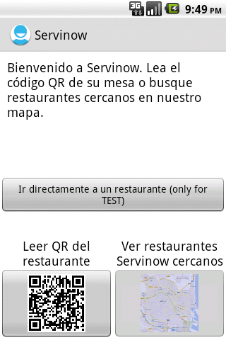

# Servinow

Servinow is a service to speed up and manage orders in a restaurant. The Android app allows the customers to book, order and pay from the table place or restaurant line.

## Features

* Scan the QR code at the table of the restaurant to start using the system.

* Navigate through the menu to check the meals and drinks.

* Select the quantity wanted of each item and add it to the order.

* Check the state of the order in real time (ordered, cooking, ready, served).

* Pay through PayPal.

## Notes

* The system uses a cache to store the data and images retrieved from the server.

* ORMLite allows working with the SQLite database.

* ActionBarSherlock is used to get the ActionBar pattern on versions previous to Ice Cream Sandwich.
